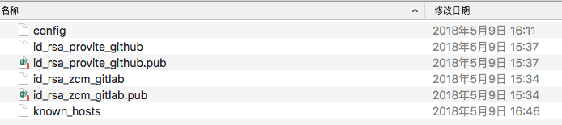
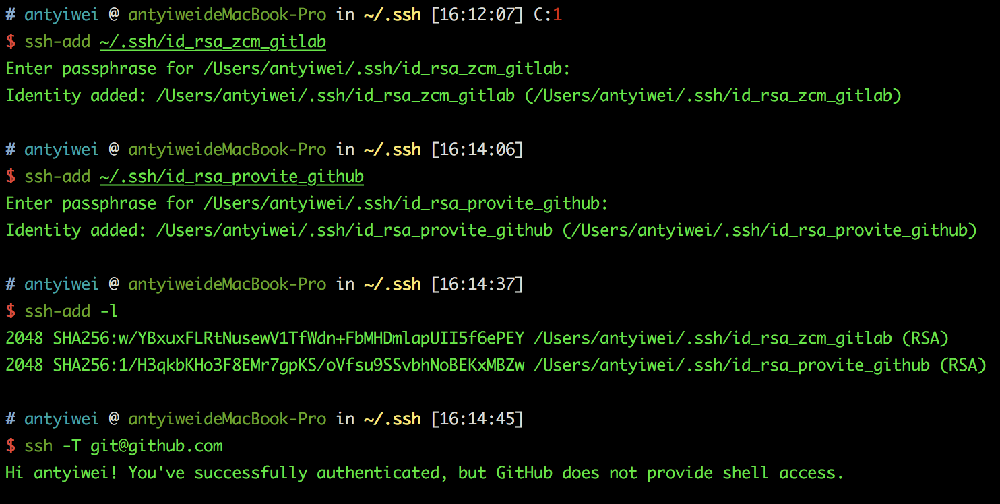
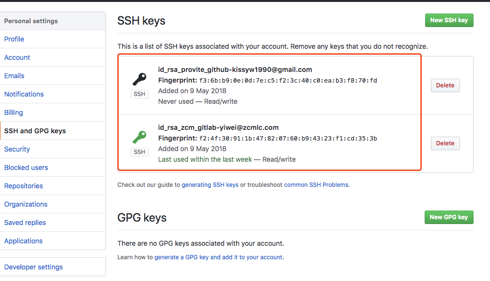
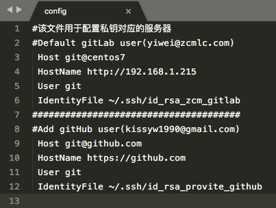

# 同一客户端下使用多个git账号
在日常使用git作为仓库使用的时候，有时可能会遇到这样的一些情况:
```
1. - 有两个github账号，一台电脑同时连接这两个账号进行维护
2. - 私人github账号；公司gitlab账号
```
## 设置多账号
* 清除git的全局设置
* 生成新的SSH keys
* 添加并识别新的SSH keys私钥
* 添加新的SSH keys到Git账号的SSH设置中
* 配置~/.ssh/config文件
* 验证连接Git
* 可能出现的问题解决方案

### 1、清除git的全局设置
新安装git跳过这一步。如果对git设置过的user.name和user.email，类似这种设置过：
```
1. $ git config --global user.name "your_email_prefix"
2. $ git config --global user.email  "your_email"
```

必须首先删除该设置， 不然会冲突的。取消全局设置方法：
```
1. $ git config --global --unset user.name "your_email_prefix"
2. $ git config --global --unset user.email "your_email"
```

### 2、生成新的SSH keys
生成ssh keys命令：
```
1. $ ssh-keygen -t rsa -C "your_email"
```
一般直接回车，默认生成id_rsa和id_rsa.pub，id_rsa私钥_rsa_pub公钥。
**<font cour="red">多个git账户不行，需要注意，出现提示输入文件名的时候(Enter file in which to save the key (~/.ssh/id_rsa): id_rsa_chen)</font>要输入与默认配置不一样的文件名**，比如：我这里填的是 id_rsa_chen，另一个是 id_rsa_didi **

**查看生成的ssh keys**

#### 方法一：
```
1. $ open ~/.ssh
```


#### 方法二：
```
1. $ cd ~/.ssh
2. $ ls -l
3. $ cat id_rsa_chen.pub # 查看是否有内容
```
ssh keys生成完成

### 3、添加并识别新的SSH keys私钥
因为默认只读取id_rsa，为了让SSH识别新的私钥，需将其添加到SSH agent中
命令：
```
1. $ ssh-agent bash
2. $ ssh-add ~/.ssh/id_rsa
```
第一步可以略，如图：


比如:需要分别添加id_rsa_chen和id_rsa_didi。**特别注意，如果后边出行权限问题：Permission denied（Publickey),很可能是私钥没有导入ssh-agent中**

### 4、添加新的SSH keys到Git账号的SSH设置中
将新生成的公钥id_rsa_*.pub添加到你的另一个github帐号(或者公司的gitlab)下的SSH Key中。
复制公钥：
```
1. $ pbcopy < ~/.ssh/id_rsa_*.pub
```
*代表你的命名
** 添加SSH Key到Git账户设置中 **
进入git网站登录git账号，添加到settings ->SSH Key中


### 5、配置~/.ssh/config文件
创建config文件，如果没有的话
```
1. $ touch ~/.ssh/config        # 创建config文件
```
配置config信息
```
1   #该文件用于配置私钥对应的服务器
2   #Default gitHub user(chen@qq.com)
3    Host git@github.com
4    HostName https://github.com
5    User git
6    IdentityFile ~/.ssh/id_rsa_chen
7   ######################################
8   #Add gitLab user(chen@****.com)
9    Host git@git.****.com
10   HostName https://git.****.com
11   User git
12   IdentityFile ~/.ssh/id_rsa_didi
```
如图：



### 6、验证连接Git
连接git命令：
```
1. $ ssh -T git@github.com
2. Hi BeginMan! You've successfully authenticated, but GitHub does not provide shell access.
3.
4. # 上面是github的成功返回语句，下面是gitlab的成功返回语句。
5.
6. $ ssh -T git@xxxxxx.com
7. Welcome to GitLab, chen!
```
如果不能连接不成功的话，
```
1. $ ssh -vT git@gihub.com  #查看出错信息
```
问题
1 、Permission denied（Publickey)
原因：私钥和公钥不匹配，可能是其中的一个出错了！
问题描述：
```
1. $ ssh -vT git@gihub.com
```
打印出的信息：
```
1. debug1: Offering RSA public key: yourpath/.ssh/id_rsa
2. debug1: Authentications that can continue: publickey
3. debug1: Trying private key:yourpath/.ssh/id_dsa
4. debug1: Trying private key:yourpath/.ssh/id_ecdsa
5. debug1: Trying private key:yourpath/.ssh/id_ed25519
6. debug1: No more authentication methods to try.
7. Permission denied (publickey).
```

明显是没有读新创建的私钥文件id_rsa_chen
**解决方案：**
1、把私钥id_rsa_chen，重新添加到ssh_agent，并验证连接
```
1. $ ssh-agent bash
2. $ ssh-add ~/.ssh/id_rsa_chen
```
2、把公钥id_rsa_chen.pub，重新添加到git账户上SSH Keys，验证连接；
3、如果还是不行的话，建议重新生成SSH keys，按照上边的方法。


* 本文转载 [Mac客户端下使用多个git账号](https://blog.csdn.net/u014166319/article/details/78570868)
* 解释参考 [让linux也可以使用pbcopy](https://blog.csdn.net/longyinyushi/article/details/72783484)