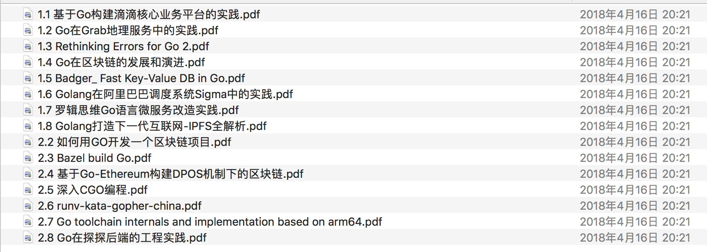
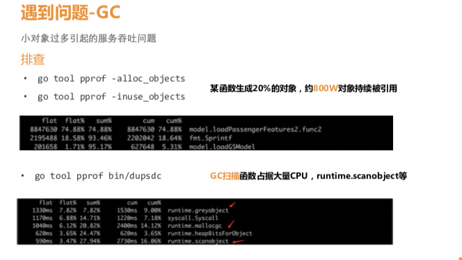
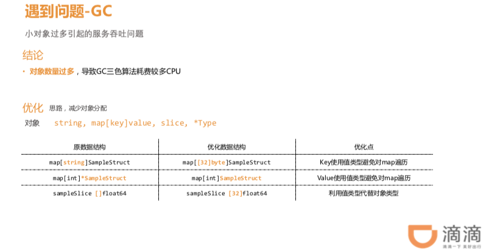
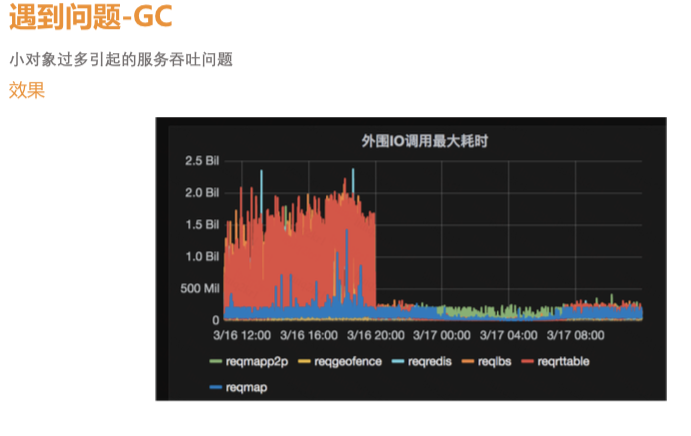

# 2018 golang大会学习分享

1.  培训一天，大会两天。学到的东西却很少。

2. 培训第一天
- golang 调用原理
- channel 两种形式
- array,map 形式
- value and pointer
- 并发 goroutine
- profiling
- 堆栈等。tracing

- 主要通过底层的一些学习。代码完善后，进行性能分析。
- 性能的分析主要是 golang的工具。go 工具包

- ops,火焰图等,gc分析等。

#### 推荐：bill 的gotraining https://github.com/ardanlabs/gotraining/tree/master/topics
里面有很多知识可以学习

2. golang 大会

###### 

- 1.1 基于Go构建滴滴核心业务平台的实践.pdf
1.double close
2.GC问题

解决方案：

优化后结果：
 

- 1.2 Go在Grab地理服务中的实践.pdf
调优使用工具：
go tool pprof
go-torch

- 1.7 罗辑思维Go语言微服务改造实践.pdf
1. 架构
2. 多级缓冲

- 总结吧
    - 源码鲁一遍
    - go tool 工具包学习