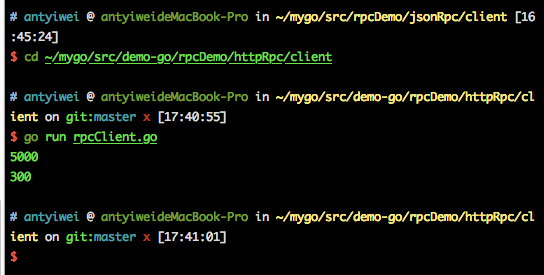

## go语言net包rpc远程调用的使用

- go对RPC的支持，支持三个级别：TCP、HTTP、JSONRPC
- go的RPC只支持GO开发的服务器与客户端之间的交互，因为采用了gob编码

### 1. 基于http的RPC
服务端:
```
package main

import (
    "log"
    "net/http"
    "net/rpc"
)

//go对RPC的支持，支持三个级别：TCP、HTTP、JSONRPC
//go的RPC只支持GO开发的服务器与客户端之间的交互，因为采用了gob编码

//注意字段必须是导出
type ParamsSer struct {
    Width, Height int
}

type Rect struct{}

//函数必须是导出的
//必须有两个导出类型参数
//第一个参数是接收参数
//第二个参数是返回给客户端参数，必须是指针类型
//函数还要有一个返回值error
func (r *Rect) Area(p ParamsSer, ret *int) error {
    *ret = p.Width * p.Height
    return nil
}

func (r *Rect) Perimeter(p ParamsSer, ret *int) error {
    *ret = (p.Width + p.Height) * 2
    return nil
}

func main() {

    rect := new(Rect)
    //注册一个rect服务
    rpc.Register(rect)
    //把服务处理绑定到http协议上
    rpc.HandleHTTP()
    err := http.ListenAndServe(":8081", nil)

    if err != nil {
        log.Fatal(err)
    }
}
```
客户端：
```
package main

import (
    "fmt"
    "log"
    "net/rpc"
)

type Params struct {
    Width, Height int
}

func main() {

    //连接远程rpc服务
    rpc, err := rpc.DialHTTP("tcp", "127.0.0.1:8081")
    if err != nil {
        log.Fatal(err)
    }

    ret := 0

    //调用远程方法
    //注意第三个参数是指针类型
    args := Params{50, 100}
    err2 := rpc.Call("Rect.Area", args, &ret)
    if err2 != nil {
        log.Fatal(err2)
    }
    fmt.Println(ret)

    err3 := rpc.Call("Rect.Perimeter", args, &ret)
    if err3 != nil {
        log.Fatal(err3)
    }

    fmt.Println(ret)
}
```
#### 输出结果：
- 服务端：

- 客户端：


### 2. 基于tcp的RPC
服务器端：
```
package main

import (
    "log"
    "net"
    "net/rpc"
)

//注意字段必须是导出
type Params struct {
    Width, Height int
}

type Rect struct {
}

func (r *Rect) Area(p Params, ret *int) error {
    *ret = p.Width * p.Height
    return nil
}

func (r *Rect) Perimeter(p Params, ret *int) error {
    *ret = (p.Width + p.Height) * 2
    return nil

}

func chkError(err error) {
    if err != nil {
        log.Fatal(err)
    }
}

func main() {
    rect := new(Rect)
    //注册rpc服务
    rpc.Register(rect)
    //获取tcpaddr
    tcpaddr, err := net.ResolveTCPAddr("tcp4", "127.0.0.1:8082")
    chkError(err)

    //监听端口
    tcplisten, err2 := net.ListenTCP("tcp", tcpaddr)
    chkError(err2)
    //死循环处理连接请求
    for {
        conn, err3 := tcplisten.Accept()
        if err3 != nil {
            continue
        }
        //使用goroutine单独处理rpc连接请求
        go rpc.ServeConn(conn)
    }
}
```
客户端：
```
package main

import (
    "fmt"
    "log"
    "net/rpc"
)

type Params struct {
    Width, Height int
}

func chkError(err error) {
    if err != nil {
        log.Fatal(err)
    }
}
func main() {
    //连接远程rpc服务
    //这里使用Dial，http方式使用DialHTTP，其他代码都一样
    rpc, err := rpc.Dial("tcp", "127.0.0.1:8082")
    chkError(err)

    ret := 0
    //调用远程方法
    //注意第三个参数是指针类型
    err2 := rpc.Call("Rect.Area", Params{50, 100}, &ret)
    chkError(err2)
    fmt.Println(ret)

    err3 := rpc.Call("Rect.Perimeter", Params{50, 100}, &ret)
    chkError(err3)
    fmt.Println(ret)
}

```
#### 输出结果：
- 服务端：

- 客户端：


### 3. 基于jsonrpc的PRC
服务器端：
```
package main

import (
    "log"
    "net"
    "net/rpc"
    "net/rpc/jsonrpc"
)

type Params struct {
    Width, Height int
}

type Rect struct{}

func (r *Rect) Area(p Params, ret *int) error {

    *ret = p.Width * p.Height
    return nil
}

func (r *Rect) Perimeter(p Params, ret *int) error {
    *ret = (p.Width + p.Height) * 2
    return nil
}

func chkError(err error) {
    if err != nil {
        log.Fatal(err)
    }
}

func main() {
    rect := new(Rect)
    //注册rpc服务
    rpc.Register(rect)
    //获取tcpaddr
    tcpaddr, err := net.ResolveTCPAddr("tcp4", "127.0.0.1:8083")
    chkError(err)
    //监听端口
    tcplisten, err2 := net.ListenTCP("tcp", tcpaddr)
    chkError(err2)

    for {
        conn, err3 := tcplisten.Accept()
        if err3 != nil {
            continue
        }
        //使用goroutine单独处理rpc连接请求
        //这里使用jsonrpc进行处理
        go jsonrpc.ServeConn(conn)
    }
}
```
客户端：
```
package main

import (
    "fmt"
    "log"
    "net/rpc/jsonrpc"
)

//注意字段必须是导出
type Params struct {
    Width, Height int
}

func chkError(err error) {
    if err != nil {
        log.Fatal(err)
    }
}

func main() {
    //连接远程rpc服务
    //这里使用jsonrpc.Dial
    rpc, err := jsonrpc.Dial("tcp", "127.0.0.1:8083")
    chkError(err)

    ret := 0
    //调用远程方法
    //注意第三个参数是指针类型
    err2 := rpc.Call("Rect.Area", Params{50, 100}, &ret)
    chkError(err2)
    fmt.Println(ret)

    err3 := rpc.Call("Rect.Perimeter", Params{50, 100}, &ret)
    chkError(err3)
    fmt.Println(ret)
}

```

#### 输出结果：
- 服务端：

- 客户端：


####  -------------------------------------------------------------------------------------------------------------------
####  -------------------------------------------以上来自网络整理-------------------------------------------------------
####  -------------------------------------------------------------------------------------------------------------------
